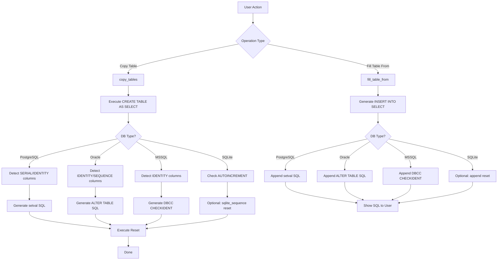

# Multi-Database Sequence Reset Plan

## Problem Statement

When users perform "Copy table" or "Fill table from..." operations, the auto-increment sequences/identities of the destination table are not updated. This causes subsequent INSERT operations to fail with duplicate key errors.

## Supported Database Types

The DB Explorer supports 4 database types:
1. **Oracle** (OracleDB, Oracle)
2. **SQLite**
3. **PostgreSQL**
4. **MSSQL** (Microsoft SQL Server)

---

## Database-Specific Auto-Increment Mechanisms

### 1. PostgreSQL

#### Types of Auto-Increment Columns
| Type | Description | Detection |
|------|-------------|-----------|
| `SERIAL`, `BIGSERIAL`, `SMALLSERIAL` | Pseudo-types backed by sequences | `column_default LIKE 'nextval%'` |
| `IDENTITY` (PostgreSQL 10+) | SQL standard identity columns | `is_identity = 'YES'` |

#### Detection Query
```sql
SELECT column_name, column_default, is_identity, data_type
FROM information_schema.columns
WHERE table_schema = 'schema_name'
  AND table_name = 'table_name'
  AND (
    (column_default LIKE 'nextval%' AND column_default NOT LIKE 'NULL%')
    OR is_identity = 'YES'
  )
ORDER BY ordinal_position;
```

#### Reset SQL
```sql
SELECT setval(
    pg_get_serial_sequence('schema_name.table_name', 'column_name'),
    COALESCE((SELECT MAX("column_name") FROM "schema_name"."table_name"), 1),
    true
);
```

---

### 2. Oracle

#### Types of Auto-Increment Columns
| Type | Description | Detection |
|------|-------------|-----------|
| **Sequences with Triggers** | Traditional approach (pre-12c) | Triggers using `sequence_name.NEXTVAL` |
| **IDENTITY columns** (Oracle 12c+) | `GENERATED ALWAYS AS IDENTITY` | `IDENTITY_COLUMN = 'YES'` in `ALL_TAB_COLUMNS` |
| **Default with Sequence** (Oracle 12c+) | `DEFAULT ON NULL sequence_name.NEXTVAL` | `DEFAULT_ON_NULL = 'YES'` and `DATA_DEFAULT LIKE '%NEXTVAL%'` |

#### Detection Query
```sql
SELECT column_name, data_default, identity_column, default_on_null
FROM all_tab_columns
WHERE owner = 'SCHEMA_NAME'
  AND table_name = 'TABLE_NAME'
  AND (
    identity_column = 'YES'
    OR (default_on_null = 'YES' AND UPPER(data_default) LIKE '%NEXTVAL%')
  )
ORDER BY column_id;
```

#### Reset SQL for IDENTITY Columns
```sql
-- For IDENTITY columns, we need to find the associated sequence
-- Oracle 12c+ stores identity sequences in ALL_SEQUENCES
-- The sequence name is typically: ISEQ$$_<object_id>

SELECT 'ALTER TABLE ' || owner || '.' || table_name || 
       ' MODIFY ' || column_name || 
       ' GENERATED BY DEFAULT AS IDENTITY (START WITH ' || 
       (NVL((SELECT MAX(column_name) FROM "SCHEMA_NAME"."TABLE_NAME"), 0) + 1) || 
       ')'
FROM all_tab_columns
WHERE owner = 'SCHEMA_NAME'
  AND table_name = 'TABLE_NAME'
  AND identity_column = 'YES';
```

Alternatively, for a simpler approach that works for both IDENTITY and default sequences:
```sql
-- Get the sequence name and reset it
-- For identity columns, find the associated sequence
SELECT s.sequence_name, s.last_number
FROM all_sequences s
JOIN all_tab_columns c ON ... -- Complex join needed

-- Simpler: Just use ALTER TABLE ... MODIFY ... START WITH
DECLARE
  v_max_val NUMBER;
BEGIN
  SELECT NVL(MAX(column_name), 0) + 1 INTO v_max_val FROM schema_name.table_name;
  EXECUTE IMMUTE 'ALTER TABLE schema_name.table_name MODIFY column_name GENERATED BY DEFAULT AS IDENTITY (START WITH ' || v_max_val || ')';
END;
```

For practical implementation, we'll use a PL/SQL block:
```sql
DECLARE
  v_max_val NUMBER;
BEGIN
  SELECT NVL(MAX("COLUMN_NAME"), 0) + 1 INTO v_max_val FROM "SCHEMA_NAME"."TABLE_NAME";
  FOR rec IN (
    SELECT column_name FROM all_tab_columns
    WHERE owner = 'SCHEMA_NAME'
      AND table_name = 'TABLE_NAME'
      AND (identity_column = 'YES' OR (default_on_null = 'YES' AND UPPER(data_default) LIKE '%NEXTVAL%'))
  ) LOOP
    EXECUTE IMMUTE 'ALTER TABLE "SCHEMA_NAME"."TABLE_NAME" MODIFY "' || rec.column_name || '" GENERATED BY DEFAULT AS IDENTITY (START WITH ' || v_max_val || ')';
  END LOOP;
END;
```

---

### 3. SQLite

#### Types of Auto-Increment Columns
| Type | Description | Detection |
|------|-------------|-----------|
| `INTEGER PRIMARY KEY` | ROWID alias, auto-increments implicitly | `pk > 0 AND type LIKE '%INT%'` |
| `INTEGER PRIMARY KEY AUTOINCREMENT` | Explicit AUTOINCREMENT keyword | Check `sql` in `sqlite_master` |

#### Detection Query
```sql
-- Get columns that are INTEGER PRIMARY KEY (potential auto-increment)
SELECT name AS column_name, type, pk
FROM pragma_table_info('table_name')
WHERE pk > 0 AND UPPER(type) LIKE '%INT%';

-- Check for explicit AUTOINCREMENT in table SQL
SELECT sql FROM sqlite_master WHERE type = 'table' AND name = 'table_name';
```

#### Reset SQL
SQLite doesn't have a direct sequence reset for ROWID. However:
- For `INTEGER PRIMARY KEY` (without AUTOINCREMENT): No action needed - ROWID automatically uses max+1
- For `INTEGER PRIMARY KEY AUTOINCREMENT`: Reset the `sqlite_sequence` table

```sql
-- Reset AUTOINCREMENT sequence (only for tables with explicit AUTOINCREMENT)
DELETE FROM sqlite_sequence WHERE name = 'table_name';
-- Or set to specific value:
-- UPDATE sqlite_sequence SET seq = <max_value> WHERE name = 'table_name';
```

Note: SQLite's AUTOINCREMENT is different from other databases - it prevents reuse of deleted ROWIDs. For most cases, no reset is needed.

---

### 4. Microsoft SQL Server (MSSQL)

#### Types of Auto-Increment Columns
| Type | Description | Detection |
|------|-------------|-----------|
| `IDENTITY` | `IDENTITY(seed, increment)` | `is_identity = 1` in `sys.columns` |
| `SEQUENCE` objects | Standalone sequence objects | `sys.sequences` joined with column defaults |

#### Detection Query
```sql
-- Find IDENTITY columns
SELECT c.name AS column_name, t.name AS table_name, s.name AS schema_name
FROM sys.columns c
JOIN sys.tables t ON c.object_id = t.object_id
JOIN sys.schemas s ON t.schema_id = s.schema_id
WHERE s.name = 'schema_name'
  AND t.name = 'table_name'
  AND c.is_identity = 1;

-- Find columns using SEQUENCE objects (via default constraint)
SELECT c.name AS column_name, dc.definition AS default_def
FROM sys.columns c
JOIN sys.tables t ON c.object_id = t.object_id
JOIN sys.default_constraints dc ON c.default_object_id = dc.object_id
JOIN sys.schemas s ON t.schema_id = s.schema_id
WHERE s.name = 'schema_name'
  AND t.name = 'table_name'
  AND dc.definition LIKE '%NEXT VALUE FOR%';
```

#### Reset SQL for IDENTITY Columns
```sql
-- DBCC CHECKIDENT resets IDENTITY seed
DBCC CHECKIDENT ('[schema_name].[table_name]', RESEED, <new_seed>);

-- new_seed should be the MAX value (next insert will be new_seed + 1)
-- Or use NULL to auto-calculate from MAX:
DBCC CHECKIDENT ('[schema_name].[table_name]', RESEED);
```

#### Reset SQL for SEQUENCE Objects
```sql
-- For SEQUENCE objects, find and reset them
DECLARE @seq_name NVARCHAR(256) = 'schema_name.sequence_name';
DECLARE @new_value BIGINT = (SELECT MAX(column_name) FROM schema_name.table_name) + 1;

EXEC sys.sp_sequence_set_value 
    @sequence_name = @seq_name,
    @new_value = @new_value;
```

---

## Implementation Plan

### Phase 1: Add Detection Methods to Each Queries Class

#### [`QueriesPostgreSQL`](QueryManager.py:1063)
```python
@staticmethod
def get_auto_increment_columns(schema, table):
    """Get list of auto-increment columns (SERIAL, IDENTITY)."""
    return f"""
        SELECT column_name, data_type, column_default, is_identity
        FROM information_schema.columns
        WHERE table_schema = '{schema}'
          AND table_name = '{table}'
          AND (
            (column_default LIKE 'nextval%' AND column_default NOT LIKE 'NULL%')
            OR is_identity = 'YES'
          )
        ORDER BY ordinal_position
    """

@staticmethod
def generate_sequence_reset_sql(schema, table, column):
    """Generate SQL to reset a sequence for an auto-increment column."""
    return f"""
        SELECT setval(
            pg_get_serial_sequence('{schema}.{table}', '{column}'),
            COALESCE((SELECT MAX("{column}") FROM "{schema}"."{table}"), 1),
            true
        )
    """
```

#### [`QueriesOracle`](QueryManager.py:196)
```python
@staticmethod
def get_auto_increment_columns(schema, table):
    """Get list of auto-increment columns (IDENTITY, DEFAULT with SEQUENCE)."""
    return f"""
        SELECT column_name, data_default, identity_column, default_on_null
        FROM all_tab_columns
        WHERE owner = '{schema}'
          AND table_name = '{table}'
          AND (
            identity_column = 'YES'
            OR (default_on_null = 'YES' AND UPPER(data_default) LIKE '%NEXTVAL%')
          )
        ORDER BY column_id
    """

@staticmethod
def generate_sequence_reset_sql(schema, table, column):
    """Generate PL/SQL block to reset an IDENTITY column."""
    return f"""
        DECLARE
            v_max_val NUMBER;
        BEGIN
            SELECT NVL(MAX("{column}"), 0) + 1 INTO v_max_val FROM "{schema}"."{table}";
            EXECUTE IMMUTE 'ALTER TABLE "{schema}"."{table}" MODIFY "{column}" GENERATED BY DEFAULT AS IDENTITY (START WITH ' || v_max_val || ')';
        END;
    """
```

#### [`QueriesSQLite`](QueryManager.py:687)
```python
@staticmethod
def get_auto_increment_columns(schema, table):
    """Get list of auto-increment columns (INTEGER PRIMARY KEY with AUTOINCREMENT)."""
    # SQLite: Check pragma_table_info for pk > 0 and type contains INT
    # Then check sqlite_master for AUTOINCREMENT keyword
    return f"""
        SELECT name AS column_name
        FROM pragma_table_info('{table}')
        WHERE pk > 0 AND UPPER(type) LIKE '%INT%'
    """

@staticmethod
def generate_sequence_reset_sql(schema, table, column):
    """Generate SQL to reset SQLite AUTOINCREMENT sequence."""
    # For SQLite, we delete from sqlite_sequence to let it auto-manage
    # Or we can skip reset entirely since SQLite handles ROWID automatically
    return f"DELETE FROM sqlite_sequence WHERE name = '{table}';"
```

#### [`QueriesMSSQL`](QueryManager.py:1513)
```python
@staticmethod
def get_auto_increment_columns(schema, table):
    """Get list of IDENTITY columns."""
    return f"""
        SELECT c.name AS column_name
        FROM sys.columns c
        JOIN sys.tables t ON c.object_id = t.object_id
        JOIN sys.schemas s ON t.schema_id = s.schema_id
        WHERE s.name = '{schema}'
          AND t.name = '{table}'
          AND c.is_identity = 1
    """

@staticmethod
def generate_sequence_reset_sql(schema, table, column):
    """Generate DBCC CHECKIDENT to reset IDENTITY column."""
    return f"DBCC CHECKIDENT ('[{schema}].[{table}]', RESEED);"
```

### Phase 2: Add Common Method to Generate All Resets

Each `Queries` class should also have:
```python
@staticmethod
def reset_auto_increment_sequences(schema, table):
    """
    Generate SQL to reset all auto-increment sequences for a table.
    Returns a list of SQL statements or a single multi-statement string.
    """
    # This will query the columns and generate reset SQL for each
    # Implementation depends on DB type
```

### Phase 3: Update [`copy_tables()`](PanelDatabaseTree.py:508)

After copying each table in PostgreSQL, Oracle, and MSSQL:
```python
# After line 594 (after copy_sql execution):
# Reset auto-increment sequences if supported by DB type
if self.db_connection.current_connection_type in ("PostgreSQL", "Oracle", "MSSQL"):
    reset_sql = queries.reset_auto_increment_sequences(target_schema, table_name)
    if reset_sql:  # May return None for SQLite or tables without auto-increment
        self.query_manager.cursor_execute(reset_sql, cursor)
```

### Phase 4: Update [`fill_table_from()`](PanelDatabaseTree.py:756)

Append sequence reset SQL to the generated INSERT statement for PostgreSQL, Oracle, and MSSQL.

---

## Mermaid Diagram - Multi-DB Sequence Reset Flow



---

## File Changes Summary

| File | Class | Changes |
|------|-------|---------|
| [`QueryManager.py`](QueryManager.py) | `QueriesPostgreSQL` | Add `get_auto_increment_columns()`, `generate_sequence_reset_sql()`, `reset_auto_increment_sequences()` |
| [`QueryManager.py`](QueryManager.py) | `QueriesOracle` | Add `get_auto_increment_columns()`, `generate_sequence_reset_sql()`, `reset_auto_increment_sequences()` |
| [`QueryManager.py`](QueryManager.py) | `QueriesSQLite` | Add `get_auto_increment_columns()`, `generate_sequence_reset_sql()`, `reset_auto_increment_sequences()` |
| [`QueryManager.py`](QueryManager.py) | `QueriesMSSQL` | Add `get_auto_increment_columns()`, `generate_sequence_reset_sql()`, `reset_auto_increment_sequences()` |
| [`PanelDatabaseTree.py`](PanelDatabaseTree.py) | `copy_tables()` | Add sequence reset after table copy |
| [`PanelDatabaseTree.py`](PanelDatabaseTree.py) | `fill_table_from()` | Append sequence reset to generated SQL |

---

## Edge Cases and Considerations

1. **Empty Tables**: Handle NULL MAX values with COALESCE/NVL
2. **Multiple Auto-Increment Columns**: Reset all of them
3. **Schema Qualification**: Always use schema-qualified names
4. **Transaction Handling**: Sequence resets should be in the same transaction
5. **Permissions**: Users need appropriate permissions for sequence operations
6. **SQLite Specific**: Most SQLite tables don't need reset - ROWID is auto-managed

---

## Testing Strategy

1. Test each DB type separately
2. Test with tables having single and multiple auto-increment columns
3. Test with empty and populated tables
4. Test copy_tables and fill_table_from operations
5. Verify subsequent INSERTs work correctly
